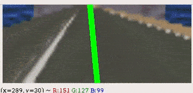

# mind_the_bend :racing_car:

Vision based deep learning for racing games. 

[](https://nbviewer.jupyter.org/github/Mayukhdeb/mind_the_bend/tree/master/)

Does the car stay on track by itself ? *yes*

Should you trust your life on it ? *no*

> Note: The  model is trained and tested on an open source racing sim called speed dreams, you can install it from [here](https://flathub.org/apps/details/org.speed_dreams.SpeedDreams)

# Ensemble model (under progresss)

.


## data collection
For the ensemble model, data was collected from 2 perspectives within the game:
* one of them would be responsible for the "colors" with a simple RGB image from the bonnet of the car 
* another one would be for the "edges" from a third person perspective 

.


# Vanilla model:

.


Here's the Project [in action](https://photos.app.goo.gl/ibtjnBxFtZ5SXGPJA)

## :movie_camera:	Collection of training data -
* Rapidly takes screenshots of the game and saves them into a folder
* The label in this case is the x-co-ordinate of the mouse which is captured by pyautogui and is stored in the formatted filename of each collected image
> image fileame formatting is done as  (x-value)_(unique_ID).png

##  :mag_right: Processing images
* Converts all images to numpy arrays with a depth of 3 for R,G and B color channels 
* The shape gets changed from  ``` [ width, height, depth ] ``` to ```[ depth, width, height]``` for it to be of the right size for the CNN input channel
* Augmentation techniques like `RandomAffine()` get applied upon the images before the forward pass through the CNN for training

## :chart_with_upwards_trend: Data preprocessing and augmentation
* First things first, plotted the frequency distribution of each steering value hen
* Roughly doubled the amount of training data by generating mirror images of existing images and vstacking them with reversed steer value. 
*  Flattened the frequency distribution by oversampling some labels with the Imbalanced-learn library and torch transforms
* Normalised the steering values by replacing the x-co-ordinates with steering values. In my case the "straight" steer value was at x = 400, for normalised_value = 400 - x_value. 
> note :  Right is negative steer value and left is positive

## :red_car: Self driving 

.

* Rapidly taken screenshots are prerpocessed and fed to the trained CNN drunk_driver()
* drunk_driver() returns a steer value 
* Returned value is taken care  of by pyautogui which moves the mouse accordingly 

.


### Stuff that's under way right now - 
* ~~take screenshots at a higher framerate both while collecting training data and testing trained models~~
* ~~Figuring out a better data augmentation technique, instead of just making copies~~
* Create and train an ensemble model with frames from different perspectives (forward, top down)

## :heavy_exclamation_mark: need help
* need a proper way to terminate/pause the loop in wear_your_seatbelts.ipynb when the CNN takes over mouse control, currently its done by moving the mouse to the corner of the screen manually 
* ~~kernel dies after about 5 mins of data collection in collect_training_data.ipynb~~


